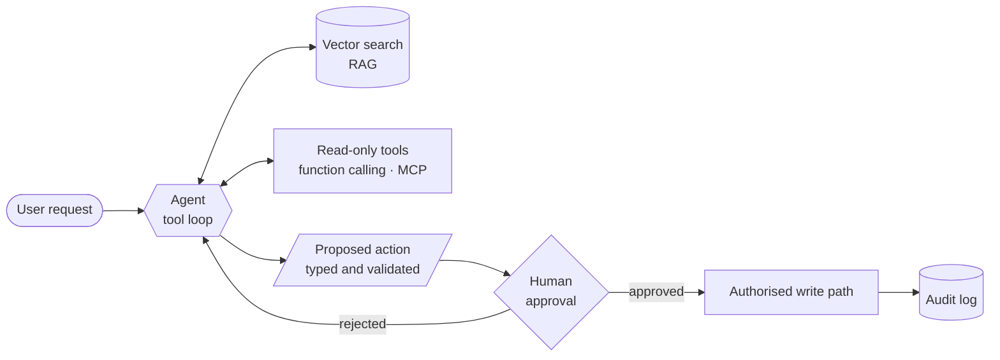

<picture>
  <source media="(prefers-color-scheme: dark)" srcset="./assets/header-dark.svg">
  <source media="(prefers-color-scheme: light)" srcset="./assets/header-light.svg">
  
</picture>

  
  
  
  

I've spent four years building production web applications in PHP and Laravel: learning platforms, e-commerce stores, CRMs and a multi-tenant workforce platform. Since 2025 most of my new work has been agentic AI. LLM agents with real tool access, retrieval pipelines, and workflows where the model proposes and a person approves.

The part I care about is the engineering around the model: what an agent is allowed to touch, how it fails safely, and how it fits into a codebase a team already depends on.

## What I work on

<table>
<tr>
<td width="50%" valign="top">

**Agentic AI systems**

- Tool-calling agents behind a policy-enforced, read-only tool registry
- Tool definitions that serve both function calling and **MCP**
- RAG over vector databases, with reranking before the model sees results
- Multi-agent orchestration, with LangGraph and with custom orchestrators
- Human-in-the-loop approval before anything is written
- Model routing, provider fallback and circuit breakers across OpenAI, Claude and local models
- Voice AI: streaming speech-to-text and synthesised replies

</td>
<td width="50%" valign="top">

**Full stack platforms**

- Laravel applications end to end: schema, queues, APIs, admin consoles
- Multi-tenant SaaS, CRMs, e-commerce and payment integrations
- Vue.js, Livewire, React and Next.js front ends
- MySQL, PostgreSQL and Redis, with idempotent background workers
- Python and FastAPI services for the AI side
- WordPress and WooCommerce custom development

</td>
</tr>
</table>

## How I build agents

- **Tool access is enforced in code, not in the prompt.** An allowlist is checked on every call, so a hallucinated tool call can't become a real write.
- **The model proposes and a person approves** anything irreversible or outward-facing.
- **Outputs are structured and validated** against a schema, not prose to be parsed.
- **Retrieved content is treated as data, never as instructions**, which is the first line of defence against prompt injection.
- **Every model vendor sits behind one interface.** Switching providers is configuration, and a circuit breaker moves traffic when one fails.
- **Correctness lives in the database**: unique constraints, row locks and `ON CONFLICT`, not an `if exists()` check two workers can both pass.

## Featured work

<table>
<tr>
<td width="50%" valign="top">

### [AI Lead Generation Platform](https://aownabbas.netlify.app/work/ai-lead-generation-platform/)
A lead lifecycle engine, not a scraper: 13 states, four-tier deduplication, AI research and drafted outreach, and human approval before anything sends. Idempotency enforced in Postgres, around 25 test suites against a real database. *Private repo, case study linked.*

`Python` `FastAPI` `SQLAlchemy` `PostgreSQL` `Redis` `Claude`

</td>
<td width="50%" valign="top">

### [LLM-first Assistant Rebuild](https://aownabbas.netlify.app/work/ai-chat-lead-platform/)
Traced why a customer-facing AI assistant misrouted real questions (regex rules into fixed templates, with the model only as a fallback) and led the rebuild to LLM-first handling with embedding-based semantic retrieval. *Employer work, case study linked.*

`PHP` `WordPress` `WooCommerce` `OpenAI` `Embeddings`

</td>
</tr>
<tr>
<td width="50%" valign="top">

### [Multi-tenant Workforce Platform](https://aownabbas.netlify.app/work/shift2go-hrm/)
Rostering, timesheets, leave balances and payroll reporting, with per-company rules and subscription tiers. Live in production. *Client work, case study linked.*

`Laravel` `Vue.js` `MySQL` `Multi-tenant`

</td>
<td width="50%" valign="top">

### [Learning Management Platform](https://aownabbas.netlify.app/work/destinator-university/)
Course catalogue, enrolment, progress tracking and an instructor and admin back office, with checkout through four payment gateways. *Client work, case study linked.*

`Laravel` `Vue.js` `MySQL` `Stripe` `PayPal`

</td>
</tr>
</table>

## Tech stack

**AI and agents** 
        

**Backend** 
      

**Frontend** 
     

**Data and retrieval** 
     

**Platforms and tools** 
     

## Right now

- Full stack and AI engineering at **Carbon Reprographics** (remote, US)
- Building the **AI lead generation platform** above
- Open to **Full Stack Engineer** and **Agentic AI Engineer** roles, remote or relocating for the right team

Case studies, screenshots and architecture for all of the above at <a href="https://aownabbas.netlify.app">aownabbas.netlify.app</a>

